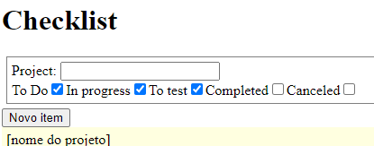

# Adicionar nova tarefa

Par adicionar uma nova tarefa, basta clicar no botão "Nova tarefa" localizado abaixo dos filtros.

<figure><figcaption></figcaption></figure>

Preencher o fomulario e clicar no boão salvar

.png>)&#x20;
